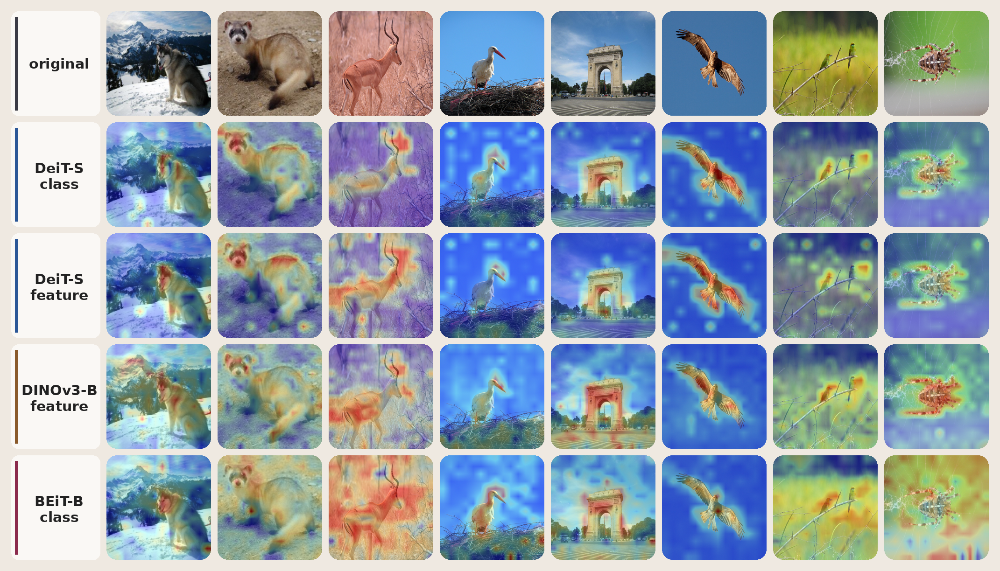

# DAAM for timm Vision Transformers



Lightweight DAAM attribution toolkit for `timm` Vision Transformer classifiers.
It turns a single image prediction into cumulative and per-layer attention
attribution maps that can be inspected, saved, or overlaid on the source image.
This project is an independent, compact reimplementation of Dynamic
Accumulated Attention Map for modern `timm` ViT workflows.

## Highlights

- Native `timm` integration for ViT-style image classifiers.
- Model-aware preprocessing through `timm.data.resolve_model_data_config`.
- Gradient-weighted attribution for the predicted class or a custom target.
- Cumulative maps, per-block maps, and PIL heatmap overlay utilities.
- Explicit hook lifecycle with CPU/CUDA device selection.

## Installation

```bash
pip install -e .
```

For the pinned local environment:

```bash
pip install -r requirements.txt
```

## Quick Start

```python
from daam import TimmViTDAAM, load_image, overlay_heatmap, prepare_image

image = load_image("InputImage/ILSVRC2012_val_00000269.JPEG")

with TimmViTDAAM.from_name("vit_base_patch16_224", pretrained=True) as daam:
    tensor = prepare_image(image, daam.model)
    result = daam(tensor)

overlay = overlay_heatmap(image, result.final_map)
overlay.save("daam_overlay.png")

print(result.predicted_index, result.probabilities.max().item())
```

Explain a non-top class by passing a target index:

```python
result = daam(tensor, target_index=243)
```

## API

- `TimmViTDAAM.from_name(model_name, pretrained=True, device="auto")` builds a
  supported `timm` classifier and registers attribution hooks.
- `prepare_image(image, model)` applies the inference transform expected by the
  selected model.
- `DAAMResult.final_map` returns the accumulated attribution map across blocks.
- `DAAMResult.last_layer_map` returns the attribution map from the final block.
- `overlay_heatmap(image, heatmap, alpha=0.45)` returns a blended PIL image.

## Supported Models

DAAM targets ViT-style `timm` classifiers with `model.blocks[*].attn` attention
blocks. Validated families include BEiT, DeiT, EVA, FlexiViT, NaFlexViT, ViT,
and ViTamin variants.

See [docs/support_list.md](docs/support_list.md) for the smoke-tested model
list. Support means hook compatibility for DAAM forward/backward passes; large
models may still require CUDA memory tuning.

## Constraints

- One image per call: tensors must be shaped `[1, C, H, W]`.
- Model output must be a tensor of class logits.
- Non-ViT architectures are intentionally out of scope.

## Citation

DAAM was introduced in the Pattern Recognition paper below. If this
implementation supports your research or engineering work, please cite the
original method:

```bibtex
@article{yiliaoPR2025dynamic,
  title={Dynamic Accumulated Attention Map for Interpreting Evolution of Decision-making in Vision Transformer},
  author={Liao, Yi and Gao, Yongsheng and Zhang, Weichuan},
  journal={Pattern Recognition},
  volume={165},
  pages={111607},
  year={2025},
  publisher={Elsevier}
}
```

## License

MIT.
